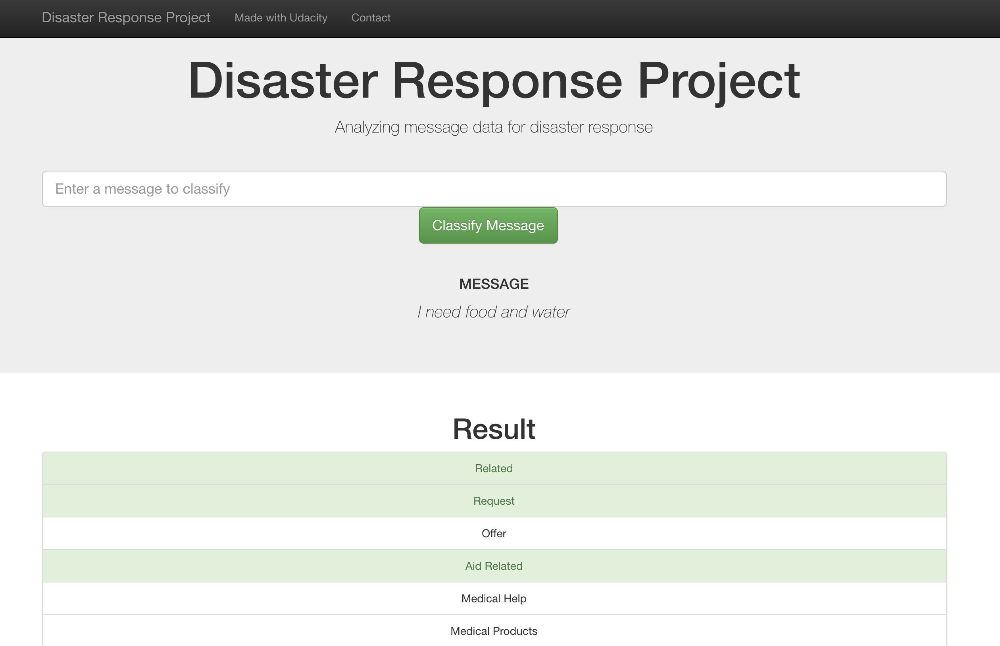
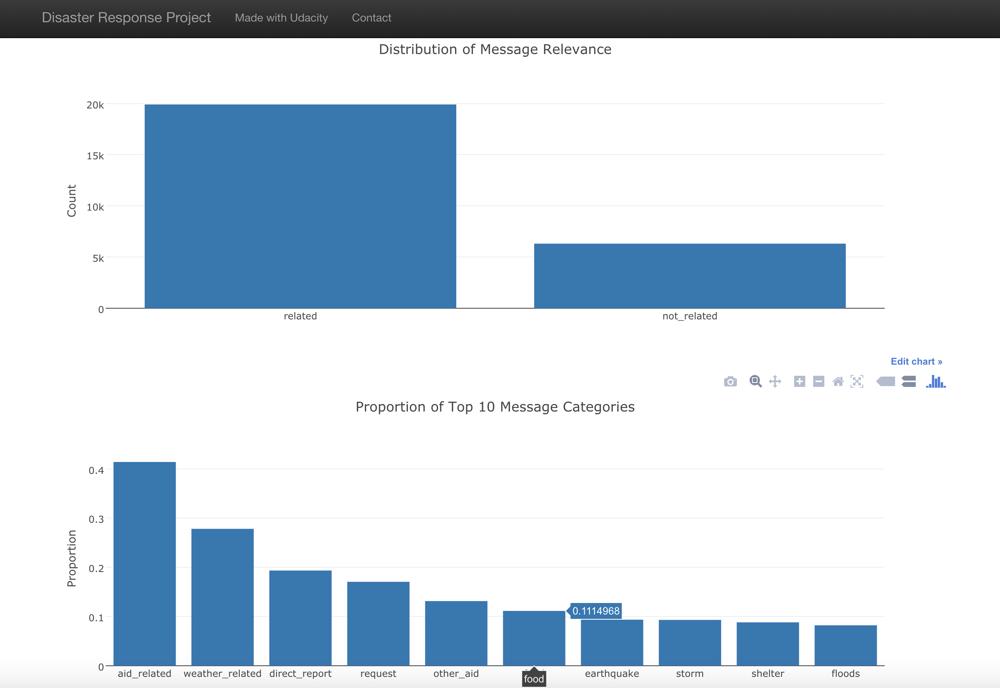

# Disaster Response Pipeline Project

## Table of Contents:

1. [Installation](#installation)
2. [Summary](#summary)
3. [File Descriptions](#files)
4. [Instructions](#instructions)
5. [Screenshots](#screen)

## Installation: 

There should be no necessary libraries to run the code here beyond the Anaconda
distribution of Python. The code should run with no issues using Python versions
3.* .

## Summary: 

This project aims to analyze disaster data from
[Figure Eight](https://www.figure-eight.com/)
to build a model for an API that classifies disaster messages. These contain
real messages that were sent during disaster events. Machine learning will
enable the categorization of these events so that an appropriate disaster
relief agency may be connected.

This project contains a web app where an emergency worker can input a message
and get classification results in several categories. Additionally,
visualizations about the data will be displayed.

## File Descriptions: 

There are three major components of this project:

1. `process_data.py`
This python script loads the `messages` and `categories` datasets, merges them,
cleans them and stores them into an SQLite database.

2. `train_classifer.py`
This python script loads the data from the SQLite database, splits the database
into training and test sets, builds a text processing and machine learning
pipeline, trains and tunes the model using GridSearchCV, outputs the results on
the test set, and finally exports the final model as a pickle file.

3. `run.py`
This python script uses Flask to run the web app. Visualizations are enabled using
Plotly.

Aside from the python scripts, there are also Jupyter notebooks which helped
start the scripts. These were used for some initial exploratory data analysis.

## Instructions: 
1. Run the following commands in the project's root directory to set up your
database and model.

    - To run ETL pipeline that cleans data and stores in database
        `python data/process_data.py data/disaster_messages.csv
        data/disaster_categories.csv data/DisasterResponse.db`
    - To run ML pipeline that trains classifier and saves
        `python models/train_classifier.py data/DisasterResponse.db
        models/classifier.pkl`

2. Run the following command in the app's directory to run your web app.
    `python run.py`

3. Go to http://0.0.0.0:3001/

## Screenshots 

The first screenshot shows the web app classifying the message the user input.

The second screenshot shows two visualizations from the cleaned dataset.

